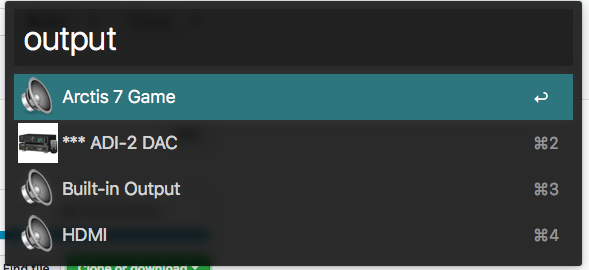

## Introduction

This is an [Alfred](http://www.alfredapp.com/) workflow for
changing the OS X input and output audio devices. Under the hood it uses
[SwitchAudio](https://github.com/deweller/switchaudio-osx) from deweller on
GitHub.

For more information and pretty pictures, I made a blog post about this when
I initially wrote it. http://michael.thegrebs.com/2013/01/18/alfred2-audio-device/

## Fork

I forked this, rewrote the perl in Ruby (because I don't know perl), and made these changes:
- It shows the currently selected device with ***
- You can add a config.yml:
  - Hide devices you never choose (input, output, or all)
  - Rename devices to have a friendly name
  - Choose an icon instead of the default

## Example:

